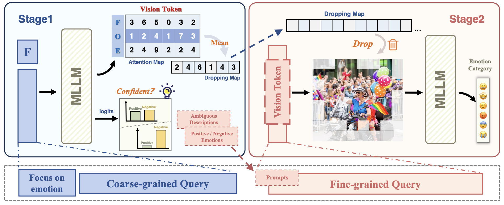
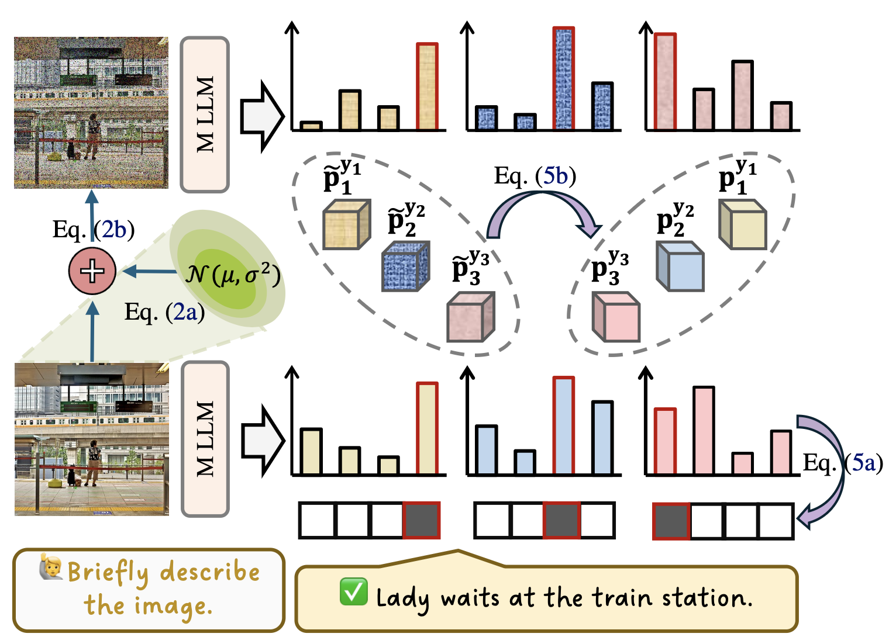
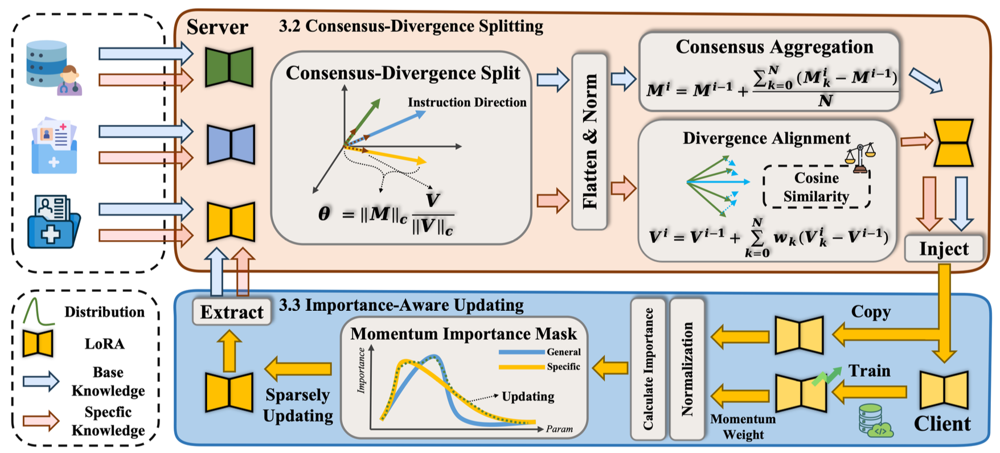
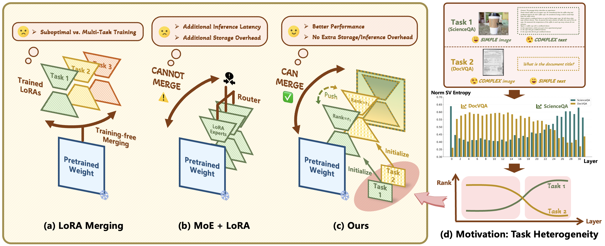








# Short Bio

I am currently a 2nd-year Ph.D. student in the [School of Computer Science at Wuhan University](https://cs.whu.edu.cn/), advised by Prof. [Mang Ye](https://scholar.google.com/citations?user=j-HxRy0AAAAJ&hl=zh-CN). Previously, I received my bachelor degree from the [School of Mathematics and Statistics at Wuhan University](https://maths.whu.edu.cn/) in 2024. If you are interested in collaborating with me or want to have a chat, always feel free to contact me through e-mail or [Wechat](https://github.com/user-attachments/assets/7777009a-aa6c-4ed9-aa4c-5da9204c03a5).

My research mainly focuses on **Multimodal Large Language Models** and **Parameter-Efficient Fine-Tuning**.

<!--
# 🔥 News

<ul>
  <li><em>[02/2025]</em> LoRASculpt was accepted to <strong>CVPR 2025</strong>.</li>
</ul>

-->

# 📝 Publications 

&dagger;: equal contribution, * : corresponding author

<dl>
  <dt></dt>
  <dd><a href="https://arxiv.org/abs/2503.16843" class="publication-title">LoRASculpt: Sculpting LoRA for Harmonizing General and Specialized Knowledge in Multimodal Large Language Models</a></dd>
  <dd><strong>Jian Liang&dagger;</strong>, Wenke Huang&dagger;, Guancheng Wan&dagger;, Qu yang, Mang Ye*</dd>
  <dd>Conference on Computer Vision and Pattern Recognition <strong>(CVPR)</strong>, 2025</dd>
  <dd><a href="https://github.com/LiangJian24/LoRASculpt">[Project Page]</a></dd>
  <dd style="color:#B02418;"><strong><em>Oral Presentation (96/13008, 0.7%)</em></strong></dd>
</dl>

<dl>
  <dt></dt>
  <dd><a href="" class="publication-title">Catch Your Emotion: Sharpening Emotion Perception in Multimodal Large Language Models</a></dd>
  <dd>Yiyang Fang&dagger;, <strong>Jian Liang&dagger;</strong>, Wenke Huang&dagger;, He Li, Kehua Su*, Mang Ye*</dd>
  <dd>International Conference on Machine Learning <strong>(ICML)</strong>, 2025</dd>
  <dd><a href="https://github.com/fuyyyyy/SEPM">[Project Page]</a></dd>
  <dd style="color:#B02418;"><strong><em>Spotlight (313/12107, 2.6%)</em></strong></dd>
</dl>

<dl>
  <dt></dt>
  <dd><a href="" class="publication-title">Be Confident: Uncovering Overfitting in MLLM Multi-Task Tuning</a></dd>
  <dd>Wenke Huang&dagger;, <strong>Jian Liang&dagger;</strong>, Guancheng Wan, Didi Zhu, He Li, Jiawei Shao, Mang Ye, Bo Du, Dacheng Tao</dd>
  <dd>International Conference on Machine Learning <strong>(ICML)</strong>, 2025</dd>
</dl>

<!--
<dl>
  <dt></dt>
  <dd><a href="" class="publication-title">Learn from Downstream and Be Yourself in Multimodal Large Language Model Fine-Tuning</a></dd>
  <dd>Wenke Huang&dagger;, <strong>Jian Liang&dagger;</strong>, Zekun Shi, Didi Zhu, Guancheng Wan, He Li, Bo Du, Dacheng Tao, Mang Ye*</dd>
  <dd>International Conference on Machine Learning <strong>(ICML)</strong>, 2025</dd>
</dl>

<dl>
  <dt></dt>
  <dd><a href="" class="publication-title">Splitting with Importance-aware Updating for Heterogeneous Federated Learning with Large Language Models</a></dd>
  <dd>Yangxu Liao, Wenke Huang, Guancheng Wan, <strong>Jian Liang</strong>, Bin Yang, Mang Ye*</dd>
  <dd>International Conference on Machine Learning <strong>(ICML)</strong>, 2025</dd>
</dl>

-->

## ⌛️ Preprint

<dl>
  <dt></dt>
  <dd><a href="https://arxiv.org/abs/2505.18640" class="publication-title">ThanoRA: Task Heterogeneity-Aware Multi-Task Low-Rank Adaptation</a></dd>
  <dd><strong>Jian Liang&dagger;</strong>, Wenke Huang&dagger;, Xianda Guo&dagger;, Guancheng Wan, Bo Du, Mang Ye*</dd>
  <dd><a href="https://github.com/LiangJian24/ThanoRA">[Project Page]</a></dd>
  <dd>arXiv</dd>
</dl>

<dl>
  <dt></dt>
  <dd><a href="https://arxiv.org/abs/2503.04543" class="publication-title">Keeping Yourself is Important in Downstream Tuning Multimodal Large Language Model</a></dd>
  <dd>Wenke Huang&dagger;, <strong>Jian Liang&dagger;</strong>, Xianda Guo&dagger;, Yiyang Fang&dagger;, Guancheng Wan&dagger;, Xuankun Rong, Chi Wen, Zekun Shi, Qingyun Li, Didi Zhu, Yanbiao Ma, Ke Liang, Bin Yang, He Li, Jiawei Shao, Mang Ye*, Bo Du*</dd>
  <dd><a href="https://github.com/WenkeHuang/Awesome-MLLM-Tuning">[Project Page]</a></dd>
  <dd>arXiv</dd>
</dl>

# 🎖 Honors and Awards
- Elite Ph.D. Talent Program in Mathematics and Artificial Intelligence of Wuhan University 
  (武汉大学数智学科博士生拔尖人才培养计划, Award Rate: <strong style="color:#B02418;">7 Members School-wide</strong>)
- National Scholarship, Wuhan University
- Outstanding Graduate of School of Mathematics and Statistics, Wuhan University
- First Class Scholarship of Wuhan University (Award Rate: <strong>5% School-wide</strong>)
- Xunteng Huang Memorial Scholarship <a href="https://edf.whu.edu.cn/info/1342/6057.htm">_Link_</a> (Award Rate: <strong>2% Department-wide</strong>)
- Huawei Intelligent Base Scholarship <a href="https://edu.hicomputing.huawei.com/winnerlist#:~:text=%E6%98%B1%E6%AC%A3%EF%BC%8C-,%E6%A2%81%E5%81%A5,-%EF%BC%8C)">_Link_</a> 

# 🎙️ Academic Service
- CSIG 武汉会员活动中心“东湖论坛”青年学者分享会（第3期）<a href="https://m.csig.org.cn/48/202504/52535.html">_Link_</a>
- VALSE 论文速览 230期 <a href="https://www.bilibili.com/video/BV1xbuJzqEvA">_Link_</a>

# 📖 Educations

- *2024.09 - now*, PhD Student, School of Computer Science, Wuhan University, China.
- *2020.09 - 2024.06*, Bachelor, School of Mathematics and Statistics, Wuhan University, China.

