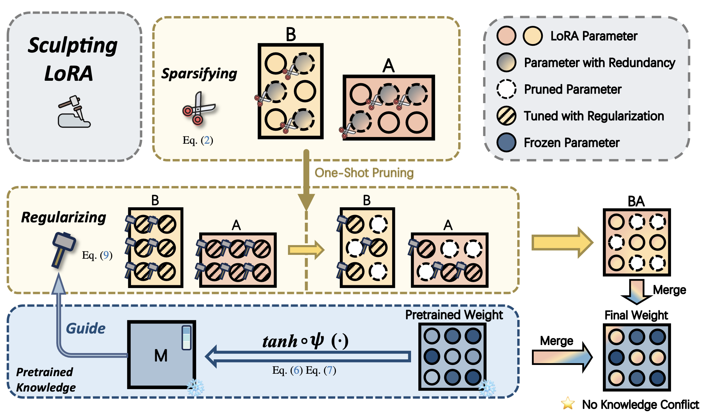
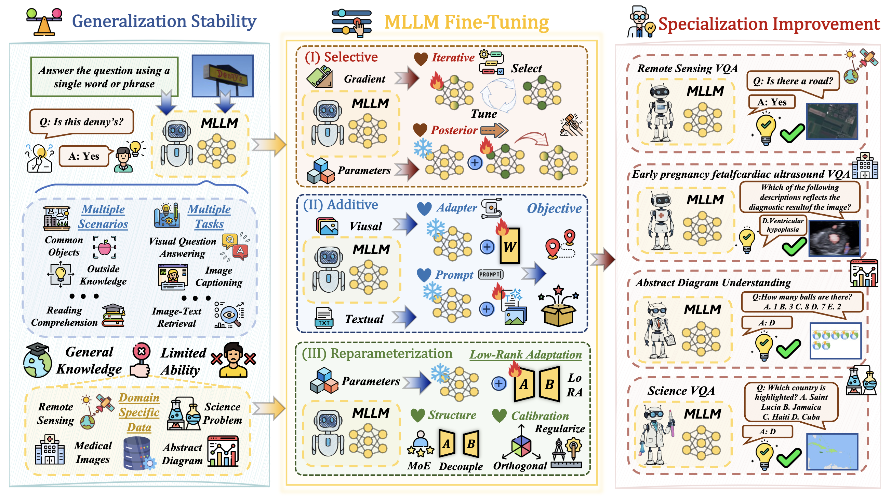
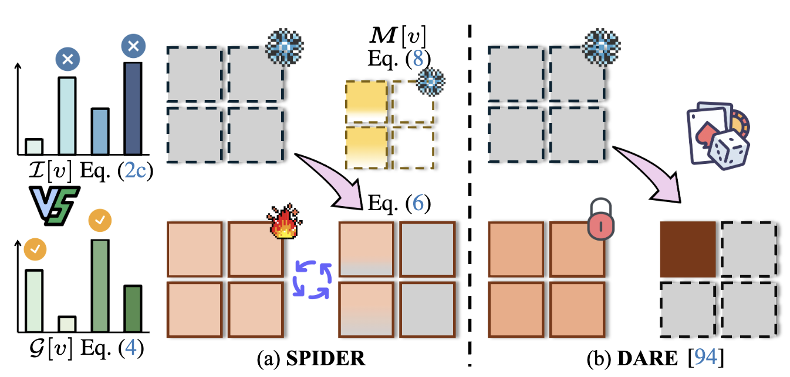








# 🧐 About Me

Hi there! My name is Jian Liang（梁健）

My research focuses on **Mutimodal Large Language Models and Parameter-Efficient Fine-Tuning**.

# 🔥 News

<ul>
  <li><em>2025.02:</em> 🚀 LoRASculpt was accepted to <strong>CVPR 2025</strong>.</li>
</ul>

# 📝 Publications 

&dagger;: equal contribution, * : corresponding author

<dl>
  <dt></dt>
  <dd><a href="" class="publication-title">LoRASculpt: Sculpting LoRA for Harmonizing General and Specialized Knowledge in Multimodal Large Language Models</a></dd>
  <dd><strong>Jian Liang</strong>, Wenke Huang, Guancheng Wan, Qu yang, Mang Ye*</dd>
  <dd>Conference on Computer Vision and Pattern Recognition **(CVPR)**, 2025</dd>
</dl>

## ⌛️ In Submission & Preprint

<dl>
  <dt></dt>
  <dd><a href="https://arxiv.org/abs/2503.04543" class="publication-title">Keeping Yourself is Important in Downstream Tuning Multimodal Large Language Model</a></dd>
  <dd>Wenke Huang&dagger;, <strong>Jian Liang&dagger;</strong> (co-first), Xianda Guo, Yiyang Fang, Guancheng Wan, Xuankun Rong, Chi Wen, Zekun Shi, Qingyun Li, Didi Zhu, Yanbiao Ma, Ke Liang, Bin Yang, He Li, Jiawei Shao, Mang Ye*, Bo Du*</dd>
  <dd>Under Review</dd>
</dl>

<dl>
  <dt></dt>
  <dd><a href="https://arxiv.org/abs/2411.10928" class="publication-title">Learn from Downstream and Be Yourself in Multimodal Large Language Model Fine-Tuning</a></dd>

  <dd>Wenke Huang, <strong>Jian Liang</strong>, Zekun Shi, Didi Zhu, Guancheng Wan, He Li, Bo Du, Dacheng Tao, Mang Ye*</dd>
  <dd>Under Review</dd>
</dl>

# 🎖 Honors and Awards

# 📖 Educations

